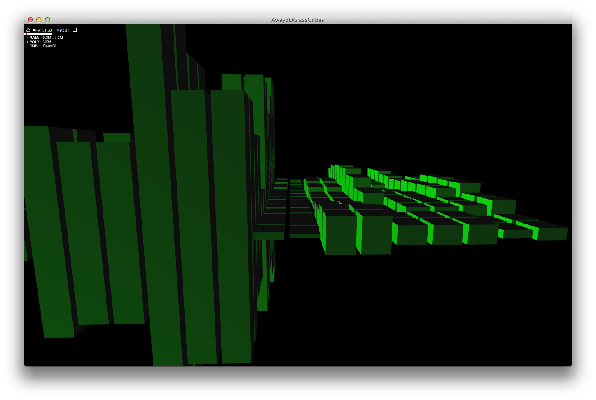

# FlashSoundVisualizations

A few experiments on visualizing sound in Flash, using files or the microphone.

**Creation date:** 11/2013

**Development time:** 2 weeks

**Tools :**

- Adobe AIR
- Flex 4.6

**Screenshots**

_Away3DSoundVisualizer/_

_Away3DSoundVisualizer/_

_SoundSpectrumBubbles/_

